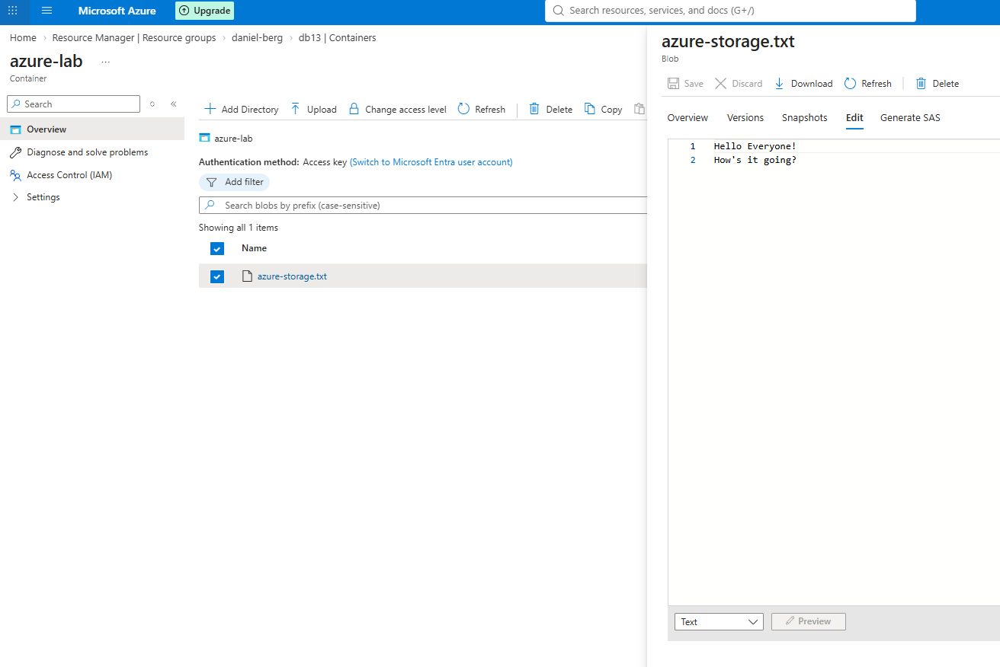
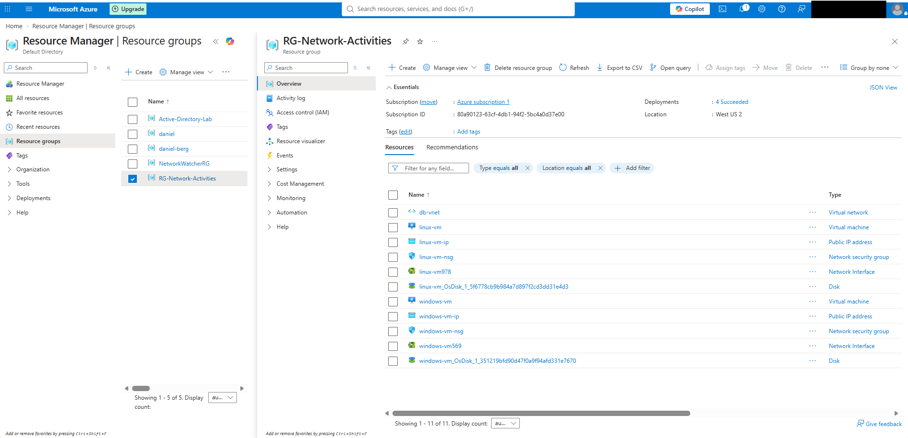
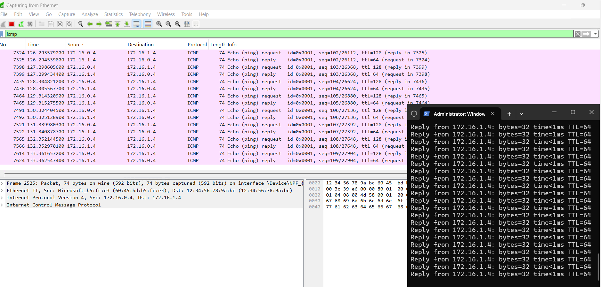
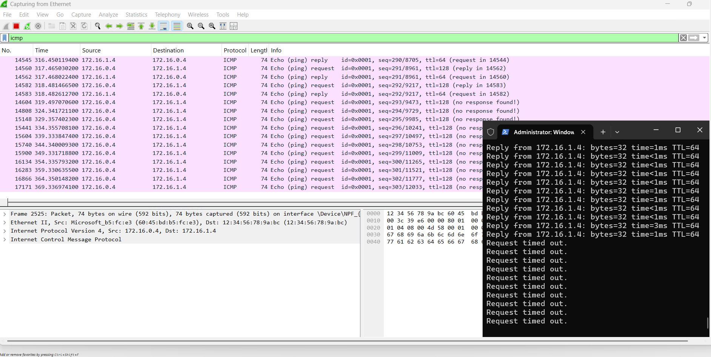
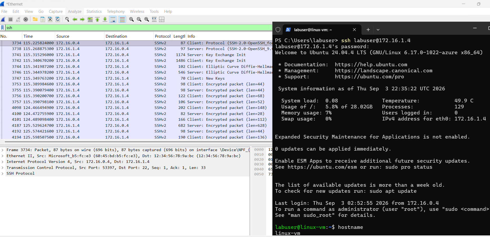
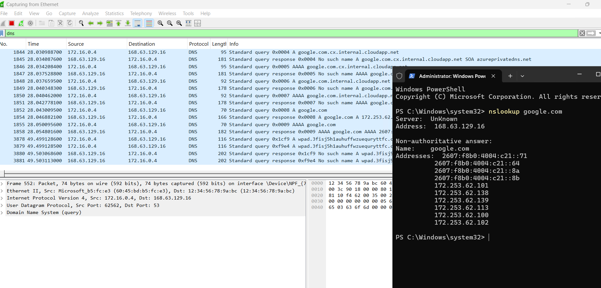

# ☁️ Azure Infrastructure & Networking Lab

A hands-on cloud infrastructure and networking lab using Microsoft Azure, Windows 11, Ubuntu Linux, and Wireshark to practice cloud resource management, virtual networking, network security, and protocol analysis.

I created a small Azure environment with Windows and Linux virtual machines, connected them through a virtual network, configured network security rules, and used Wireshark to observe how common network protocols behave.

---

## 🛠️ Technologies Used

- Microsoft Azure
- Azure Virtual Machines
- Azure Virtual Network (VNet)
- Network Security Groups (NSGs)
- Azure Blob Storage
- Locally Redundant Storage (LRS)
- Windows 11 Pro
- Ubuntu Server 24.04 LTS
- Wireshark
- PowerShell
- SSH
- Remote Desktop (RDP)
- TCP/IP
- ICMP
- DNS
- DHCP

---

## ☁️ 1. Configure Azure Storage

I started by creating the `daniel-berg` resource group in **West US 2** and a storage account named `db13` to practice organizing and managing cloud resources.

I configured the storage account for **Azure Blob Storage** using **Locally Redundant Storage (LRS)**.

Inside the storage account, I created a Blob Storage container called:

```text
azure-lab
```

I then created and uploaded:

```text
azure-storage.txt
```

After uploading the file, I edited its contents directly through Azure and downloaded the modified version to verify the changes.

```text
Resource Group
      │
      ▼
Storage Account
      │
      ▼
Blob Container
      │
      ▼
azure-storage.txt
```

This demonstrated how files can be stored, modified, downloaded, and managed using Azure Blob Storage.



---

## 🖥️ 2. Build the Azure Network Environment

Next, I created a separate resource group for the networking portion of the lab:

```text
RG-Network-Activities
```

I deployed two virtual machines in **East US 2**:

- **windows-vm** — Windows 11 Pro (`Standard_D2als_v6`)
- **linux-vm** — Ubuntu Server 24.04 LTS

Both virtual machines were connected to the same Azure virtual network:

```text
db-vnet
```

The environment also included the supporting network interfaces, public IP addresses, disks, and Network Security Groups for each virtual machine.

```text
Microsoft Azure
       │
RG-Network-Activities
       │
    db-vnet
     /   \
    /     \
windows-vm  linux-vm
Windows 11  Ubuntu Linux
```

I connected to `windows-vm` using **Remote Desktop (RDP)** through its public IP address. From the Windows VM, I could then communicate with `linux-vm` across the Azure virtual network using its private IP address.



---

## 🌐 3. Test Network Connectivity with ICMP

After building the environment, I installed **Wireshark** on `windows-vm` to capture and analyze network traffic.

I first used PowerShell to view the Windows VM's network configuration:

```powershell
ipconfig /all
```

This displayed information such as IP configuration, DNS and DHCP information, and network adapter details.

I then tested communication between the two virtual machines by continuously pinging the private IP address of `linux-vm`:

```powershell
ping 172.16.1.4 -t
```

At the same time, I captured the traffic with Wireshark using the display filter:

```text
icmp
```

Wireshark showed alternating **ICMP Echo Requests** and **Echo Replies** between the two virtual machines.

```text
windows-vm
    │
    │ ICMP Echo Request
    ▼
linux-vm
    │
    │ ICMP Echo Reply
    ▼
windows-vm
```

The successful replies confirmed that the Windows and Linux systems could communicate across the Azure virtual network.



---

## 🔐 4. Control Network Traffic with an NSG

Next, I used a **Network Security Group (NSG)** to see how Azure security rules affect network communication.

I created an inbound rule for `linux-vm` that denied ICMP traffic.

While continuously pinging the Linux VM, the responses changed from successful replies to:

```text
Request timed out.
```

Wireshark also changed from showing ICMP request/reply pairs to showing only outgoing requests with no responses.



Removing the deny rule restored normal communication.

This demonstrated how Network Security Groups can control traffic between Azure resources and how Wireshark can be used to troubleshoot connectivity problems.

---

## 🐧 5. Connect to Linux with SSH

With connectivity restored, I remotely connected from the Windows VM to the Linux VM using **SSH**.

From PowerShell on `windows-vm`, I connected using the Linux VM's private IP address:

```powershell
ssh labuser@172.16.1.4
```

After connecting, the terminal changed from the Windows PowerShell prompt to the Linux shell.

I verified which system I was connected to using:

```bash
hostname
```

which returned:

```text
linux-vm
```

At the same time, I captured the connection in Wireshark using:

```text
ssh
```

Wireshark showed SSH traffic traveling between the two private IP addresses over **TCP port 22**.



This demonstrated how SSH can be used to securely administer a Linux system remotely while the session's data is encrypted in transit.

---

## 📡 6. Analyze Common Network Protocols

I also used Wireshark to examine several common protocols used in everyday network communication.

### DNS

I filtered Wireshark for DNS traffic and generated a DNS lookup from the Windows VM:

```powershell
nslookup google.com
```

The lookup returned IP addresses associated with the domain while Wireshark displayed the corresponding DNS queries and responses.



This demonstrated how DNS translates human-readable domain names into IP addresses that computers can use to communicate.

### DHCP

I filtered Wireshark for DHCP traffic and renewed the Windows VM's network configuration using:

```powershell
ipconfig /renew
```

This allowed me to observe DHCP-related traffic used to automatically configure network settings for the virtual machine.

### RDP

Because I was accessing `windows-vm` through Remote Desktop, I also inspected the traffic associated with the RDP connection using the Wireshark filter:

```text
tcp.port == 3389
```

This showed the TCP traffic used to maintain the remote Windows session.

---

## 💰 7. Review Azure Resource Management and Costs

Throughout the lab, I also practiced basic Azure resource administration.

I used **Cost Management → Cost Analysis** to review charges associated with the resources running in my Azure subscription.

I also learned how resource groups make it easier to organize related cloud infrastructure and manage the lifecycle of multiple resources together.

Once the lab resources are no longer needed, the resource groups and their associated resources can be removed to clean up the environment and prevent unnecessary usage and charges.

---

## 🧠 What I Learned

This project helped me understand how cloud infrastructure and networking concepts work together inside Microsoft Azure.

I gained hands-on experience with:

- Creating and organizing Microsoft Azure resources
- Creating and managing Azure Blob Storage
- Working with Locally Redundant Storage (LRS)
- Deploying Windows and Linux virtual machines
- Connecting virtual machines through an Azure VNet
- Working with private and public IP addresses
- Accessing a Windows VM through Remote Desktop
- Inspecting Windows network configuration with PowerShell
- Testing network connectivity with ICMP and `ping`
- Capturing and analyzing network traffic with Wireshark
- Configuring Network Security Group rules
- Troubleshooting blocked network communication
- Remotely administering Linux using SSH
- Observing DNS queries and responses
- Working with DHCP network configuration
- Identifying Remote Desktop traffic
- Reviewing Azure resource costs

The biggest takeaway was seeing how **virtual machines, virtual networks, IP addressing, security rules, remote access, and network protocols all work together in a cloud environment.**

---

## 📁 Repository Structure

```text
azure-infrastructure-and-networking-lab/
│
├── README.md
│
└── images/
    ├── azure-blob-storage.png
    ├── azure-network-environment.png
    ├── dns-analysis.png
    ├── icmp-connectivity.png
    ├── nsg-icmp-block.png
    └── ssh-linux-connection.png
```
